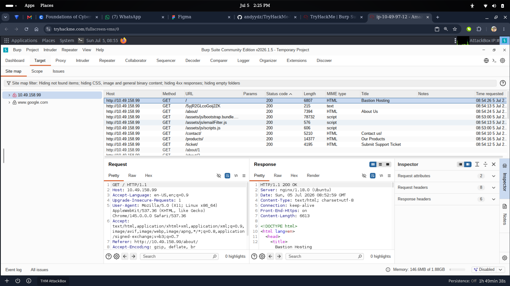
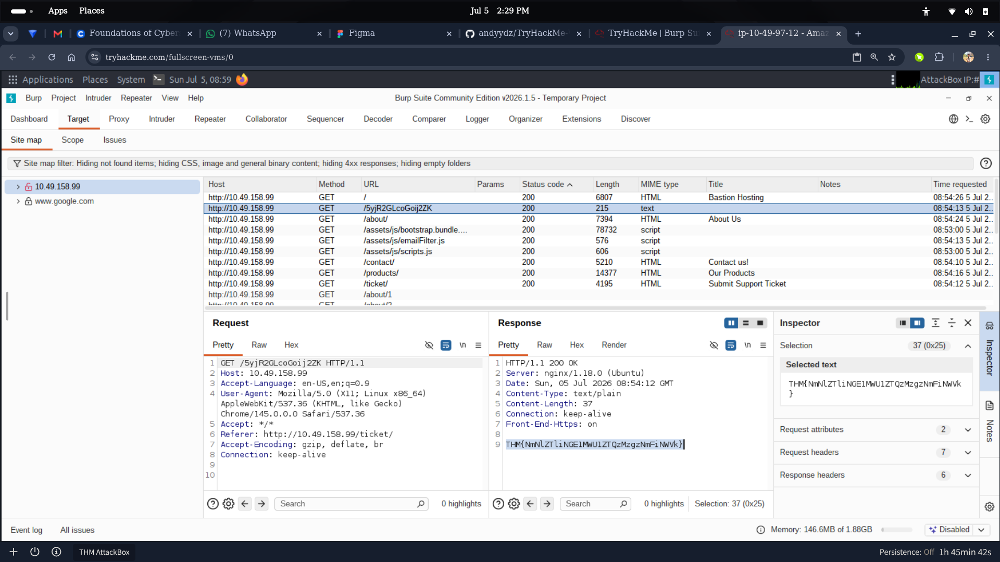

# Web App Recon with Burp Suite

Hands-on web application reconnaissance using **Burp Suite Community Edition**, simulating how an analyst passively maps an application's attack surface by proxying traffic and reviewing the site map/HTTP history for hidden or undocumented endpoints.

---

##Scenario — Proxy-Based Recon & Hidden Endpoint Discovery

**Goal:** Route browser traffic through Burp Suite's proxy to build a full picture of a target web app's structure, then dig through the captured requests to find endpoints that aren't linked anywhere in the visible UI.

**Workflow:**
1. **Proxy & HTTP History** – Configured Burp as an intercepting proxy and browsed the target site normally (Home, About, Contact, Products, Support Ticket) so every request/response was captured in the Site map and Proxy → HTTP history.
2. **Request/Response Analysis** – Reviewed the captured traffic and spotted an unlinked path (not present anywhere in the visible site navigation) in the site map. Sent the request and inspected the raw response in the Inspector panel, which returned a plain-text value — not something a normal user would ever stumble onto through the UI.

**What this demonstrates:** setting up and using Burp Suite as an intercepting proxy, reading raw HTTP requests/responses, and the recon habit of reviewing *everything* the browser touches (not just what's visibly linked) to uncover hidden functionality or exposed data.

> *[Verdict:"HTTP request and response analysis revealed no exploitable behavior.The application traffic was successfully intercepted and validated for further security testing."]*

*Proxy & Site Map — full HTTP history of the target application*

*Inspecting the request/response of a hidden, unlinked endpoint*

---

##Skills Demonstrated
- Configuring and using Burp Suite as an intercepting proxy
- Reading and interpreting the Site map / HTTP history
- Manual request/response inspection (Pretty/Raw/Hex views)
- Recon mindset — finding what isn't advertised in the UI
- Recognizing exposed/sensitive data returned by an endpoint

---

*Part of my [SOC-Portfolio](https://github.com/andyydz/SOC-Portfolio) — a collection of hands-on blue team investigations across Splunk, Elastic (ELK), Wazuh, and Wireshark.*
