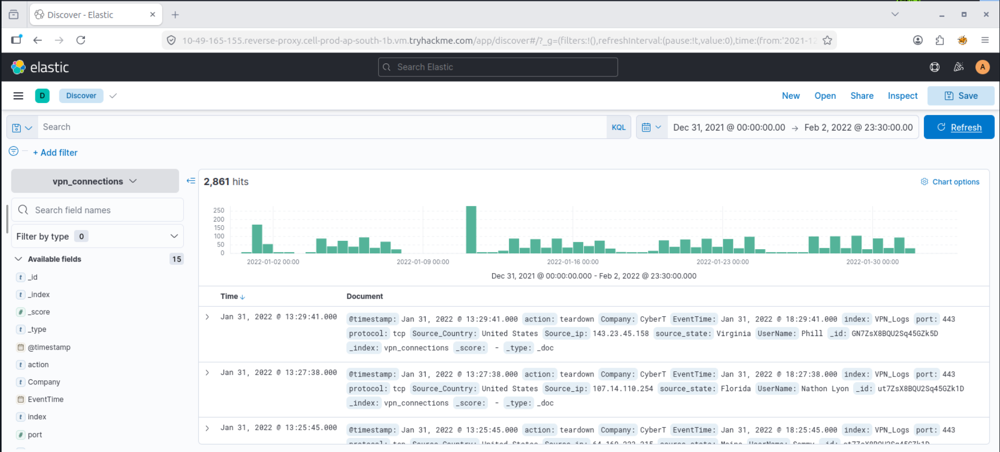
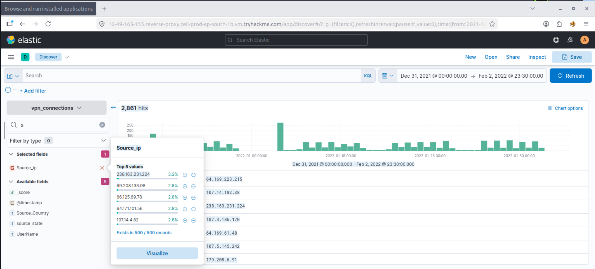
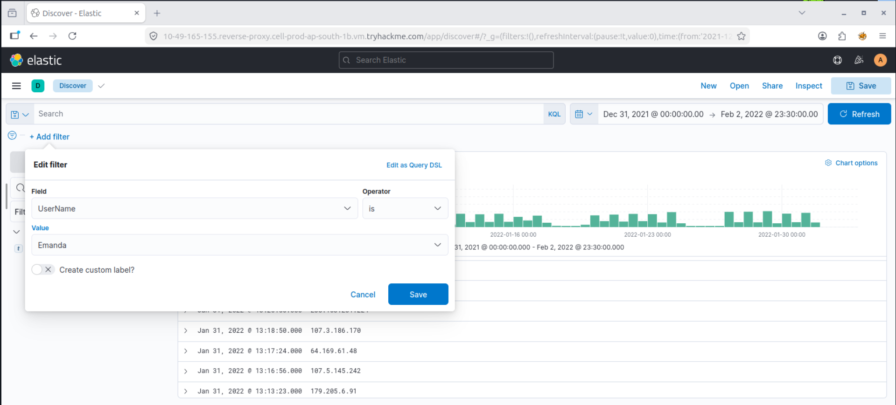
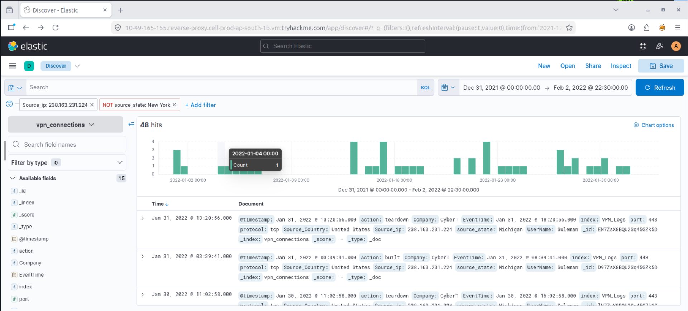
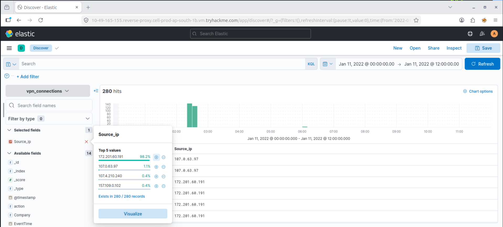

# Investigation with Elastic (ELK Stack)

Hands-on log investigation using **Kibana Discover**, simulating an L1 SOC Analyst pivoting through raw VPN logs to identify patterns, isolate a suspicious source, and quantify the scope of activity.

---

##Scenario — VPN Log Analysis via Kibana Discover

**Goal:** Investigate VPN authentication logs in Kibana to identify anomalous source IP activity and understand the scale/distribution of connections.

**Workflow:**
1. **Kibana Discover — VPN Logs** – Opened the VPN log index in Discover to review raw authentication events.
2. **Field Statistics on Source IP** – Used Kibana's field statistics view to get a quick breakdown of the most frequent source IPs hitting the VPN.
3. **Add Filters** – Applied filters to narrow the dataset down to the source IP(s) of interest.
4. **Filtered Log Results** – Reviewed the filtered event set to inspect timestamps, usernames, and connection details tied to that IP.
5. **Source IP Distribution** – Visualized the distribution of source IPs to spot outliers — one IP generating disproportionate volume compared to normal baseline traffic.

**What this demonstrates:** comfort navigating Kibana Discover for log triage, using field statistics to spot outliers fast, building filters to narrow noisy datasets, and reasoning about volume/distribution to separate normal traffic from anomalous activity.

> *[Verdict:"Log analysis and event filtering successfully identified relevant security events.Correlation of source IP activity enabled efficient investigation,with no confirmed indicators of compromise requiring escalation"]*

| Kibana Discover — VPN Logs | Field Statistics — Source IP |
|---|---|
|  |  |

| Add Filters | Filtered Log Results |
|---|---|
|  |  |

*Source IP Distribution*

---

## Skills Demonstrated
- Kibana Discover navigation and raw log review
- Field statistics for rapid data profiling
- Filter construction to isolate relevant events
- Traffic/distribution analysis to spot outliers
- Evidence-based investigation documentation

---

*Part of my [SOC-Portfolio](https://github.com/andyydz/SOC-Portfolio) — a collection of hands-on blue team investigations across Splunk, Elastic (ELK), Wazuh, and Wireshark.*
