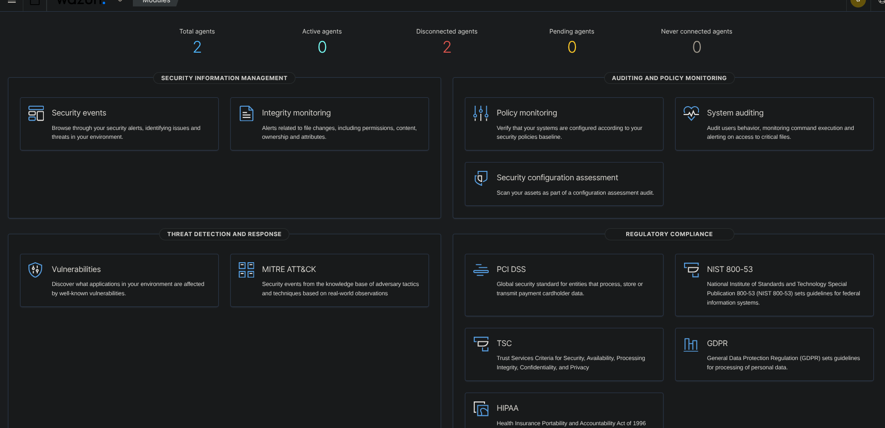
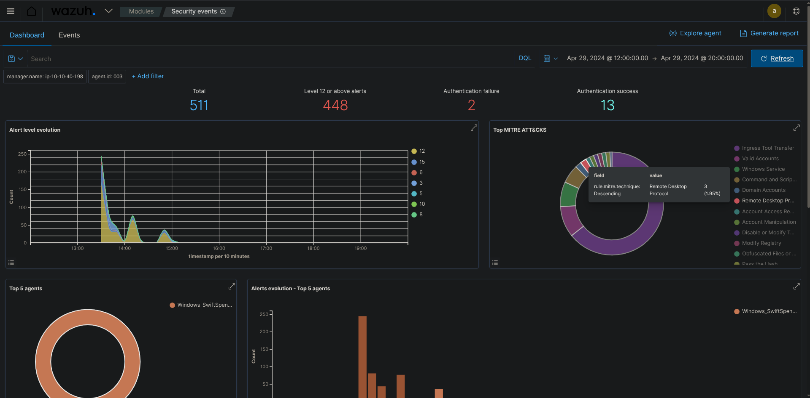
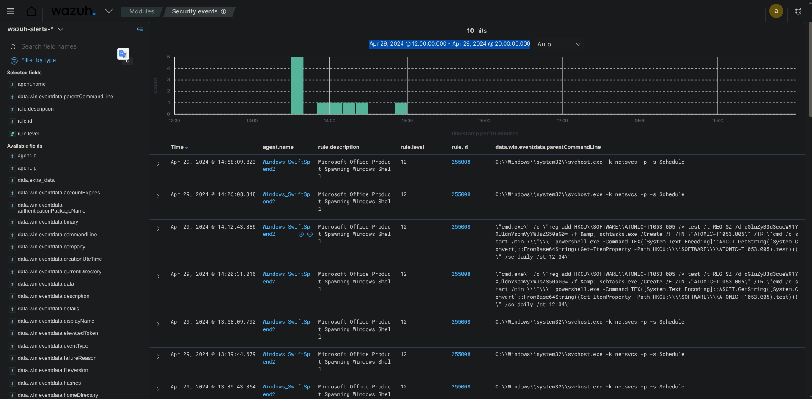
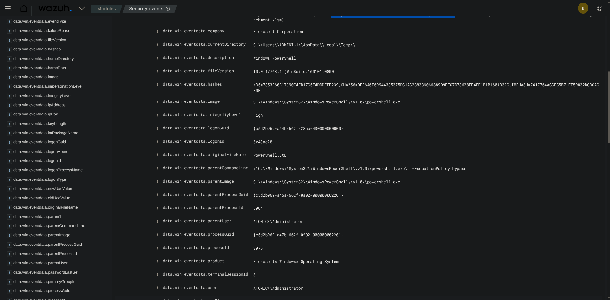
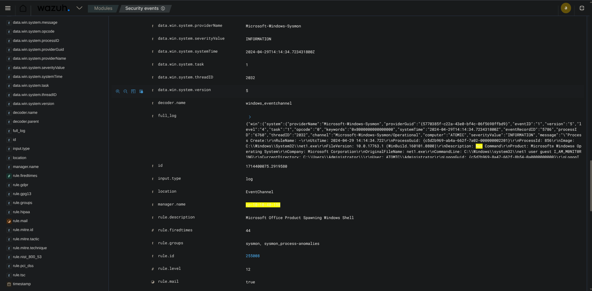
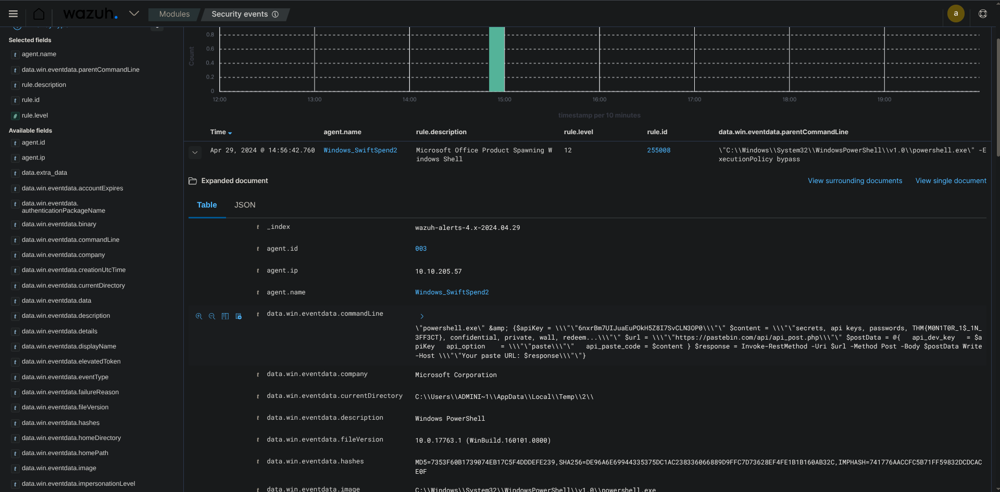

# Monday Monitor — Endpoint Monitoring Investigation with Wazuh

Hands-on SIEM investigation using **Wazuh**, simulating an L1 SOC Analyst working a live endpoint monitoring case end-to-end — from connecting into the environment through to tracing a full attack chain and confirming exfiltration.

---

## Scenario — Endpoint Compromise Investigation (Monday Monitor)

**Goal:** Connect into a provided environment and use the Wazuh dashboard to investigate a compromised endpoint — tracing a downloaded file, a persistence mechanism, an obfuscated artifact, credential dumping, and final exfiltration.

**Setup:** Connected to the target environment via **OpenVPN** from the terminal, then accessed the **Wazuh dashboard** with provided credentials to begin the investigation.

**Workflow:**

1. **Dashboard Overview** – Got oriented in the Wazuh security events dashboard to understand the environment and available log sources before diving in.
2. **Identify the Downloaded File** – Used the dashboard to find the file that had been created/downloaded onto the host — the starting point of the incident.
3. **Scheduled Task Command** – Found the full command used to create a scheduled task on the host (already present in the logs) — a classic persistence technique attackers use to maintain access.
4. **Scheduled Task Timing** – Used filters to pin down exactly what time that scheduled task was configured to run.
5. **Decoding a Suspicious Value** – Filtered down to a suspicious encoded string in the event data and decoded it to reveal its real value, confirming malicious intent.
6. **Credential Dumping** – Identified what was used to dump credentials from the host.
7. **Exfiltration & Flag** – Traced where the dumped data was exfiltrated to from the host, recovering the final flag.

**What this demonstrates:** connecting into and working a live investigation environment (OpenVPN + dashboard access), navigating raw JSON event details in Wazuh, filter-based log correlation, recognizing persistence mechanisms (scheduled tasks), decoding obfuscated data, and following a full attack chain — persistence → credential access → exfiltration — rather than looking at isolated alerts.

> *[Takeaway: This investigation walked a full attack chain end-to-end rather than one isolated alert — from a suspicious file landing on the host, through a scheduled task set up for persistence, to an obfuscated artifact that needed decoding before its true intent was clear, and finally to credential theft and exfiltration. The key lesson: surface-level alerts rarely tell the whole story — it took correlating multiple log sources and filtering through noise to reconstruct the attacker's actual sequence of actions. That's the muscle a real SOC L1 role exercises constantly: don't stop at the first finding, keep pulling the thread until you can explain the full "how did they get in, what did they do, and where did the data go."]*

*Initial Wazuh dashboard overview after connecting to the environment*

*Security events dashboard used to scope the investigation*

*Filtering the event list down to relevant activity*

*Drilling into a specific security event for details*

*Reviewing alert details tied to the suspicious activity*

*Inspecting raw JSON event data to extract the encoded value*

---

##  Skills Demonstrated
- Connecting to a target environment via OpenVPN
- Wazuh dashboard navigation and event filtering
- Reading raw JSON log data for artifact extraction
- Recognizing persistence techniques (scheduled tasks)
- Decoding obfuscated/encoded values
- Tracing credential dumping and exfiltration in a full attack chain

---

*Part of my [SOC-Portfolio](https://github.com/andyydz/SOC-Portfolio) — a collection of hands-on blue team investigations across Splunk, Elastic (ELK), Wazuh, Wireshark, and Burp Suite.*
