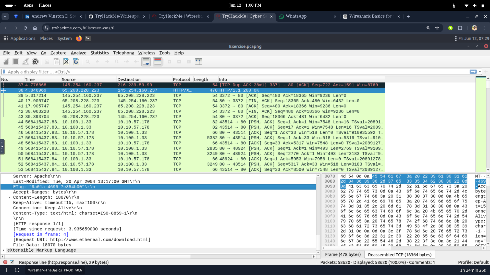
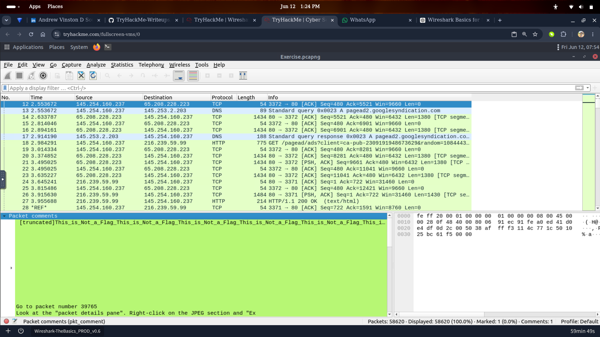
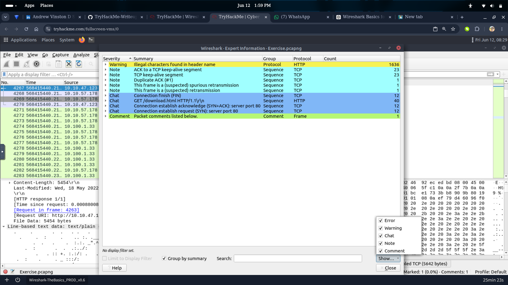
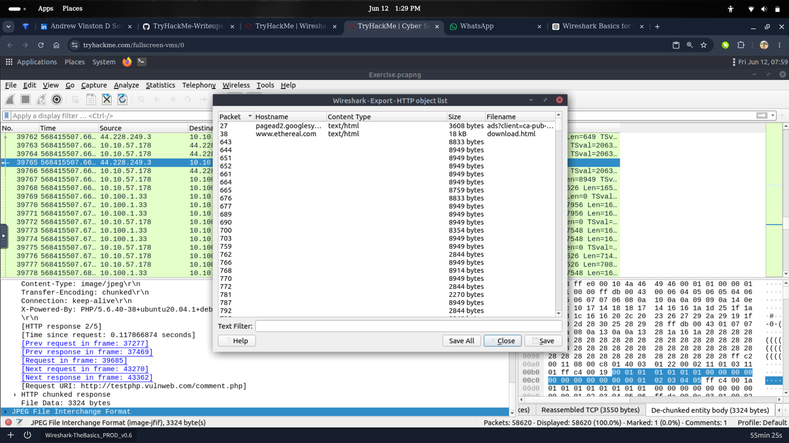

# Packet Analysis with Wireshark

Hands-on packet capture (PCAP) analysis using **Wireshark**, simulating an analyst dissecting network traffic to reconstruct sessions, inspect payloads, and pull out transferred files — the kind of deep-dive work that follows once a SIEM alert points you at a specific host or timeframe.

---

## Scenario — Full Traffic Breakdown of a Captured Session

**Goal:** Take a raw packet capture and work through it end-to-end — from high-level conversation flow down to raw payload bytes — to understand exactly what happened on the wire.

**Workflow:**
1. **HTTP Traffic Analysis** – Opened the capture and filtered down to HTTP/TCP conversations, reviewing source/destination pairs, sequence numbers, and response codes to map out the session.
2. **Packet Payload Analysis** – Drilled into individual packets' payload/hex data to inspect raw content. Also demonstrates using **packet comments** as a note-taking technique during analysis — flagging what's a genuine artifact versus a decoy in the data.
3. **Expert Information Review** – Used Wireshark's Expert Information tool to auto-surface anomalies across the whole capture — retransmissions, duplicate ACKs, keep-alive segments, and protocol warnings — instead of manually scrolling through thousands of packets.
4. **Exported HTTP Objects** – Used File → Export Objects to pull every file transferred over HTTP in the capture (images, HTML pages, ad requests) into a reviewable list, exactly how you'd recover exfiltrated or downloaded files from traffic.

**What this demonstrates:** comfort navigating Wireshark's full workflow — filtering, payload/hex inspection, using built-in anomaly detection instead of manual review, and reconstructing files straight out of a capture.

> *[Verdict:"Packet capture and protocol analysis successfully reconstructed network activity.Traffic inspection revealed no confirmed malicious communications requiring incident escalation."]*

*Reviewing the TCP/HTTP conversation flow*

*Inspecting payload/hex data and using packet comments to track findings*

*Wireshark's Expert Information view surfacing warnings and anomalies across the capture*

*Extracting every file transferred over HTTP via Export Objects*

---

##  Skills Demonstrated
- Wireshark filtering and TCP/HTTP conversation analysis
- Raw payload/hex inspection
- Using Expert Information for fast anomaly triage
- Extracting files from captured traffic (Export HTTP Objects)
- Structured note-taking during packet-level investigation

---

*Part of my [SOC-Portfolio](https://github.com/andyydz/SOC-Portfolio) — a collection of hands-on blue team investigations across Splunk, Elastic (ELK), Wazuh, and Wireshark.*
